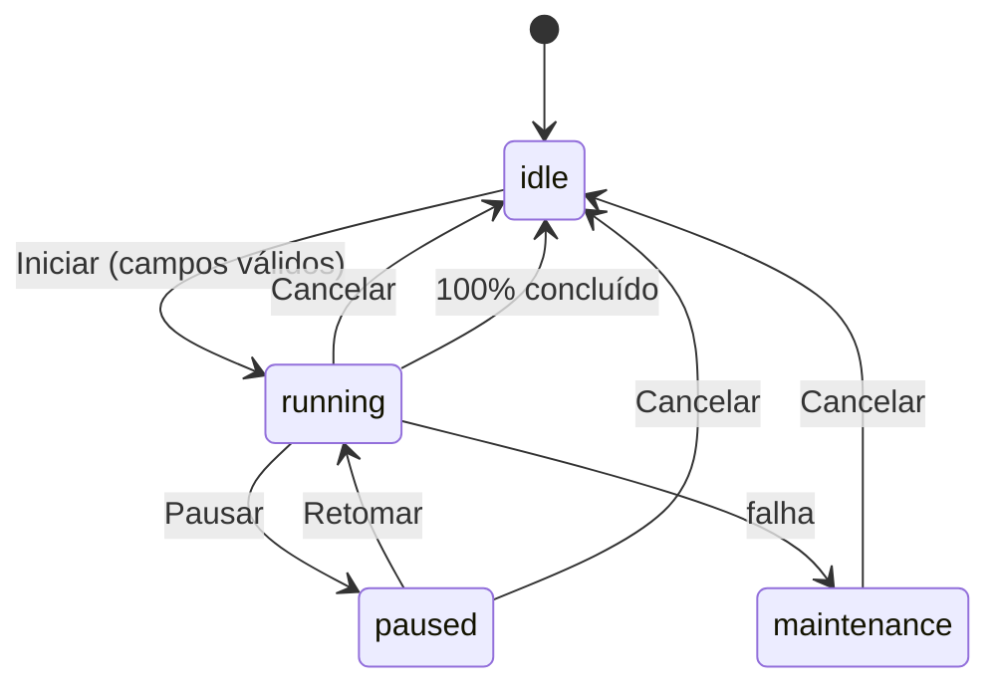

The plan is displayed below.

# Card de automações com 4 status, expansão e execução simulada

## O que os designs revelam

Os 8 nodes do Figma são **a mesma estrutura** com variações de conteúdo, não 4 cards diferentes. Isso permite um único componente com configuração por status.

**Cabeçalho (idêntico nos 4 status)** — 3 colunas: nome + badge de status (`w-40`) | alerta com ícone + título colorido + subtítulo muted, separado por `border-l` (`flex-1`) | chevron de expansão + botão de ação outline (`w-40`). Uma barra de progresso de 2px atravessa a base do cabeçalho nos status `running`, `paused` e `maintenance`.

**Corpo expandido** — duas variações apenas:
- `idle`: coluna de metadados vazios (`--/--/----`) + separador + formulário dos campos dinâmicos com botão "Iniciar".
- `running` / `paused` / `maintenance`: metadados preenchidos + separador + "Monitor de execução" (logs com timestamp e dot) + separador + "Dados enviados" (valores read-only) e botão "Cancelar" destrutivo.

O que muda por status é só: badge, ícone, textos do alerta e ação primária.

## Reaproveitamento da base de código

- `Badge` já tem exatamente as variantes necessárias: `success` (Parado), `info` (Em execução), `warning` (Pausado), `error` (Em manutenção), e `category` com dot colorido para a categoria da automação.
- `Card`, `Button` (variantes `outline`/`destructive`/`ghost`, size `icon-sm`/`sm`), `Input`, `Textarea`, `Select`, `Checkbox`, `Field`/`FieldLabel`/`FieldDescription`, `Separator`, `alertToast` — todos já existem e serão usados como estão.
- A expansão usa o `Collapsible` do shadcn e a barra de progresso usa o `Progress` do shadcn (ver seção dedicada abaixo). Nada de componente próprio para isso.
- Sem `Calendar`: `date` e `date-range` usam `<Input type="date">` (evita adicionar `react-day-picker`).
- Tokens de cor já existentes cobrem tudo; para o azul do progresso e do texto "X de N transmitidas" usarei `info-foreground` em vez de introduzir o hex `#2563eb` do Figma. Se preferir o tom exato, adiciono um token em `src/app.css`.

## Componentes shadcn a instalar

O `components.json` do projeto usa `"style": "base-vega"`, que é a variante Base UI do shadcn. O registry desse style entrega `collapsible.tsx` e `progress.tsx` sobre `@base-ui/react/collapsible` e `@base-ui/react/progress` — mesma biblioteca dos componentes já instalados, então **não há dependência npm nova** (`@base-ui/react` já está no `package.json`). Confirmei o conteúdo dos dois direto no registry antes de planejar; a versão radix que aparece no catálogo padrão do shadcn não é a que será instalada.

```bash
pnpm dlx shadcn@latest add @shadcn/collapsible @shadcn/progress
```

### Collapsible em vez de AccordionO cabeçalho do card tem dois controles independentes (o chevron e o botão de ação "Configurar"/"Pausar"/"Retomar"/"Reportar"). O `AccordionTrigger` envolve o cabeçalho inteiro em um `<button>`, o que aninharia o botão de ação dentro de outro botão — HTML inválido e conflito de clique. Além disso, cada card abre de forma independente, sem o comportamento de grupo do Accordion. Com o `Collapsible`, o trigger fica só no chevron.

Uso no `automation-card.tsx`, controlado para que o chevron e o botão "Configurar" abram o mesmo painel:

```tsx
<Collapsible open={isOpen} onOpenChange={setIsOpen} render={<Card />}>
  <AutomationCardHeader ... />
  <CollapsibleContent className="h-[var(--collapsible-panel-height)] overflow-hidden transition-[height] duration-200 ease-out data-starting-style:h-0 data-ending-style:h-0 [&[hidden]:not([hidden='until-found'])]:hidden">
    {/* corpo expandido */}
  </CollapsibleContent>
</Collapsible>
```

O chevron dentro do cabeçalho compõe o trigger com o `Button` do projeto via `render`, padrão já usado em [automations-list-page.tsx](src/features/automations/components/automations-list-page.tsx):

```tsx
<CollapsibleTrigger render={<Button variant="ghost" size="icon-sm" />}>
  <ChevronDown className="transition-transform group-data-[panel-open]/card:rotate-180" />
</CollapsibleTrigger>
```

Isso substitui o `useState` + render condicional: ganhamos animação de altura via `--collapsible-panel-height`, `aria-expanded`/`aria-controls` automáticos e a rotação do chevron por `data-panel-open` (dispensando ícones separados de `ChevronDown`/`ChevronUp`). O `open` continua sendo estado do componente, apenas passado ao `Collapsible` como controlado para o "Configurar" também alternar.

### Progress nos dois lugares onde há progresso

O `Progress` instalado renderiza `ProgressTrack > ProgressIndicator` internamente e não expõe `className` para essas partes, então o ajuste visual é feito por seletores de `data-slot` na raiz — sem editar o arquivo em `components/ui/` e sem componente próprio.

**Barra de 2px na base do cabeçalho** (`running`, `paused`, `maintenance`), em `automation-card-header.tsx`:

```tsx
<Progress
  value={runtime.total > 0 ? (runtime.processed / runtime.total) * 100 : null}
  aria-label="Progresso da execução"
  className="absolute inset-x-0 bottom-0 gap-0 [&_[data-slot=progress-track]]:h-0.5 [&_[data-slot=progress-track]]:rounded-none [&_[data-slot=progress-track]]:bg-border [&_[data-slot=progress-indicator]]:bg-info-foreground"
/>
```

`value={null}` deixa o Base UI em estado indeterminado (`data-indeterminate`), útil enquanto a execução ainda não processou nenhum item — que é como o Figma mostra o trilho vazio a 0%.

**Cabeçalho do Monitor de execução** ("Monitor de execução" à esquerda, "17%" à direita): usa `ProgressLabel` + `ProgressValue`, ocultando o trilho automático já que o design não mostra barra nessa seção. O `ProgressValue` do Base UI já formata o percentual via `Intl.NumberFormat`, dispensando concatenar `%` na mão:

```tsx
<Progress value={percent} className="w-full justify-between gap-0 [&_[data-slot=progress-track]]:hidden">
  <ProgressLabel className="text-sm font-medium text-foreground">Monitor de execução</ProgressLabel>
  <ProgressValue className="ml-0 text-sm font-medium text-foreground" />
</Progress>
```

## Arquivos

### 1. Tipos e configuração de status

Em [src/features/automations/types/automation.ts](src/features/automations/types/automation.ts), adicionar:

```typescript
export type AutomationStatus = "idle" | "running" | "paused" | "maintenance";

export type AutomationLogEntry = {
  id: string;
  time: string;          // "23:47:12"
  message: string;
  variant: "info" | "error";
};

export type AutomationRuntime = {
  status: AutomationStatus;
  processed: number;
  total: number;
  startedAt: string | null;
  finishedAt: string | null;
  elapsedSeconds: number;
  logs: AutomationLogEntry[];
  submittedValues: Record<string, string>;
};
```

E estender `AutomationParameter` com `options?: { value: string; label: string }[]` (decisão confirmada), além de `AutomationListItem` com `id`, `name`, `category`, `fields: AutomationParameter[]`.

Novo `config/automation-status.ts` com um mapa único que dirige todo o visual:

```typescript
export const AUTOMATION_STATUS_CONFIG: Record<AutomationStatus, {
  label: string;                    // "Parado" | "Em execução" | ...
  badgeVariant: "success" | "info" | "warning" | "error";
  icon: LucideIcon;                 // Check | Loader2 | Pause | ShieldAlert
  spinIcon?: boolean;               // true em running
  showProgress: boolean;            // false em idle
  action: { label: string; icon: LucideIcon }; // Configurar | Pausar | Retomar | Reportar
}>;
```

### 2. Campos dinâmicos criados na tela de criação

Em [src/features/automations/components/automation-parameter-form.tsx](src/features/automations/components/automation-parameter-form.tsx), adicionar entrada de opções (input de texto com valores separados por vírgula, exibido só quando `draft.type === "select"`), e propagar `options` em [use-automation-parameters.ts](src/features/automations/hooks/use-automation-parameters.ts) e no payload de `api/create-automation.ts`.

### 3. Mock da listagem

Novo `mocks/automations.ts` com 5 automações (REINF, DCTFWeb, eSocial, etc.), cada uma com categoria e `fields` cobrindo os tipos `file`, `select`, `date`, `text` e `checkbox`. Também um roteiro de etapas de log (`Iniciando automação`, `Acessando e-Cac`, `Autenticando certificado digital`, …) reaproveitado do design.

Uma das automações do mock já nasce em `maintenance` para o layout ficar visível sem precisar forçar um erro. As demais nascem em `idle`, conforme o fluxo descrito.

### 4. Estado e simulação

Novo `stores/automations-runtime-store.ts` (Zustand, conforme convenção do projeto para estado de UI) com `Record<automationId, AutomationRuntime>` e ações `start`, `pause`, `resume`, `cancel`, `fail`, `tick`.

Novo `hooks/use-automations-runtime-ticker.ts`: um único `setInterval` de 1s montado na lista, que para cada automação em `running` incrementa `elapsedSeconds`, avança `processed` e adiciona logs do roteiro. Ao atingir o total, volta o status para `idle` preenchendo `finishedAt`.



### 5. Componentes do card

Novos arquivos em `src/features/automations/components/`:

- `automation-card.tsx` — orquestrador: lê o runtime da store, monta o `Collapsible` controlado sobre o `Card` e decide qual corpo renderizar dentro do `CollapsibleContent`.
- `automation-card-header.tsx` — as 3 colunas comuns + o `Progress` de 2px, com o chevron como `CollapsibleTrigger`.
- `automation-status-badge.tsx` — `Badge` com a variante do status.
- `automation-card-alert.tsx` — ícone + título colorido + subtítulo, com os textos vindos do runtime (ex. `"50 de 294 transmitidas"`).
- `automation-card-metadata.tsx` — Iniciado em / Tempo decorrido / Terminado em + badge de categoria, exibindo `--/--/----` quando vazio.
- `automation-execution-monitor.tsx` — cabeçalho com `ProgressLabel`/`ProgressValue` e lista de logs rolável em `bg-accent rounded-lg`.
- `automation-submitted-data.tsx` — "Dados enviados" read-only + botão Cancelar.
- `automation-idle-form.tsx` — "Preencha os dados para iniciar" + campos dinâmicos + botão Iniciar.
- `dynamic-automation-field.tsx` — `switch` no `parameter.type` mapeando os 10 tipos para `Input`, `Textarea`, `Select`, `Checkbox`, `Input type="date"` e par de datas para `date-range`, todos envoltos em `Field`/`FieldLabel`/`FieldDescription`.
- `automations-list.tsx` — mapeia os mocks em cards e monta o ticker.

### 6. Formulário dinâmico com validação

Novo `schemas/automation-parameters-schema.ts` com `buildParametersSchema(parameters: AutomationParameter[]): z.ZodObject`, gerando o schema em runtime a partir dos parâmetros (obrigatoriedade e tipo). `automation-idle-form.tsx` usa `react-hook-form` + `zodResolver` com `mode: "onChange"`, e o botão "Iniciar" fica `disabled` até `formState.isValid` — atendendo "após o usuário preencher os campos, liberar o botão de executar".

### 7. Ligar na rota

Em [src/features/automations/components/automations-list-page.tsx](src/features/automations/components/automations-list-page.tsx), trocar `<AdminPagePlaceholder title="Automações" />` por `<AutomationsList />`, mantendo o botão "Criar automação" e a checagem de permissão.

## Pontos menores já decididos

- "Configurar" (status `idle`) expande o card, igual ao chevron — por isso o `Collapsible` fica controlado.
- "Reportar" (status `maintenance`) emite `alertToast.info` como placeholder, já que o destino ainda não existe.
- Sem chamadas de API novas: tudo lê dos mocks e da store.