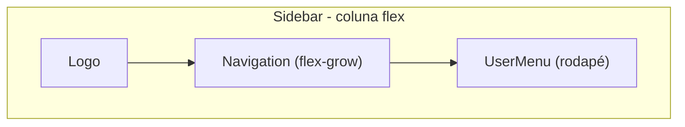
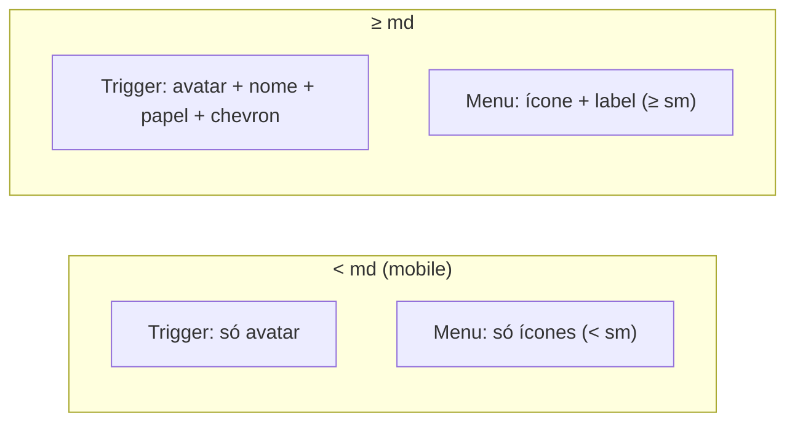
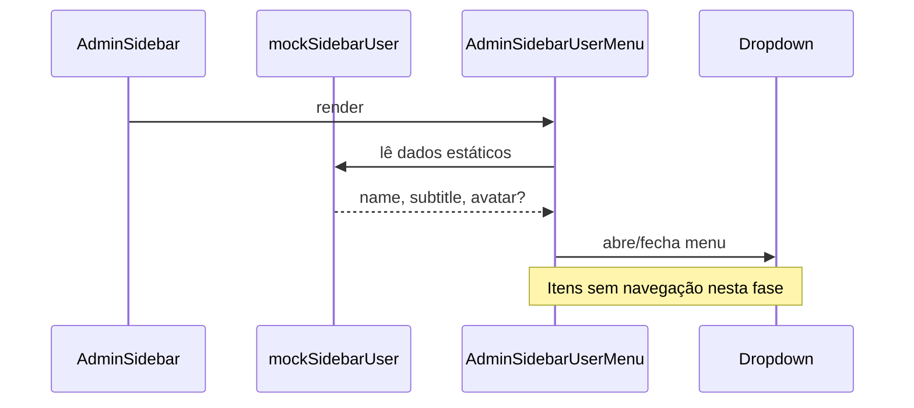
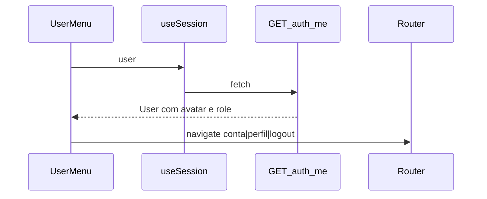

# Especificação do botão de usuário da Sidebar

Documento de migração do componente `UserMenu` do frontend antigo para o novo frontend admin.

## Objetivo

Documentar o comportamento, layout, dados e interações do componente `UserMenu` em [`plataforma/frontend/src/components/layout/Sidebar.tsx`](../../../plataforma/frontend/src/components/layout/Sidebar.tsx) para replicá-lo no novo frontend, adaptando-o ao layout admin existente em [`src/features/admin/components/admin-sidebar-nav.tsx`](../../src/features/admin/components/admin-sidebar-nav.tsx).

### Restrições da implementação no novo frontend

| Restrição | Detalhe |
|-----------|---------|
| **Design** | Seguir o design system do novo frontend (`app.css`, tokens semânticos, `AdminIcon`, padrões de `AdminSidebarNav`) — **não** copiar classes hardcoded do antigo (`zinc-*`, `gray-*`, `neutral-*`) |
| **Dados** | Usuário **mockado** nesta fase — sem integração com API `/auth/me` nem extensão de `getSession` |
| **Rotas** | **Não criar** rotas nem navegação (`/account`, `/profile`, `/logout`) — itens do menu são apenas UI; redirecionamento será desenvolvido depois |

---

## 1. Contexto no frontend antigo

### Posição na sidebar



- Container da sidebar: `bg-neutral-50`, coluna flex com `gap-9`, padding `pb-6 pt-6 sm:pt-10 px-2 sm:px-6`.
- `UserMenu` fica **no final** da coluna, após a navegação principal.
- Renderização condicional: `{user && <UserMenu user={user} />}` — só aparece com usuário autenticado.

### Fonte de dados (antigo — referência)

| Aspecto | Detalhe |
|---------|---------|
| Hook | `useCurrentUser()` → React Query |
| API | `GET /auth/me` via `userAPI.getCurrentUser()` |
| Normalização | `avatar = profilePhotoUrl ?? avatar` |
| Tipo completo | `User` em [`plataforma/frontend/src/lib/schemas.ts`](../../../plataforma/frontend/src/lib/schemas.ts) |

Campos usados pelo `UserMenu`:

```typescript
{
  name: string;
  avatar?: string;        // URL da foto (normalizada)
  role?: { name: string }; // ex.: "Admin", "Operador"
}
```

Fallback de subtítulo: `"Plataforma"` quando `role?.name` ausente.

---

## 2. Anatomia do componente

### Nome interno

`UserMenu` (função privada dentro de `Sidebar.tsx`, não exportada).

### Dependências (antigo)

- `@tanstack/react-router`: `useNavigate`
- `lucide-react`: `ChevronUp`, `Cog`, `LogOut`, `User`, `UserCog`
- `@/components/ui/dropdown-menu`: `DropdownMenu`, `DropdownMenuContent`, `DropdownMenuItem`, `DropdownMenuTrigger`

---

## 3. Trigger (botão principal)

### Elemento

- `<button>` nativo (não usa `Button` do shadcn).
- Envolvido por `<DropdownMenuTrigger asChild>`.

### Layout e classes (antigo — referência visual)

```
flex w-full cursor-pointer items-center justify-start
rounded-md py-0.5 pl-0.5 pr-0
transition-colors hover:bg-zinc-100
data-[state=open]:bg-gray-200
md:justify-between md:pr-0
```

### Bloco esquerdo (avatar + textos)

Container: `flex items-center gap-3`

**Avatar** — container `size-10 overflow-hidden rounded-md border border-neutral-300`:

| Estado | Renderização |
|--------|--------------|
| Com `user.avatar` | `` com `size-full object-cover p-0.5`, `alt={user.name}` |
| Sem avatar | Fundo `bg-zinc-100`, ícone `User` (`h-6 w-6 text-neutral-500`) centralizado |

**Textos** — visíveis apenas em `md+` (`hidden flex-col text-left md:flex`):

| Linha | Estilo | Conteúdo |
|-------|--------|----------|
| Nome | `text-sm text-neutral-900` | `user.name` |
| Papel | `text-xs font-medium leading-4 text-neutral-400` | `user.role?.name \|\| "Plataforma"` |

Fonte: `font-[var(--font-family-body)]` (Roboto).

### Bloco direito

- Ícone `ChevronUp` (`h-4 w-4 text-neutral-900 me-2`).
- Visível apenas em `md+` (`hidden md:block`).
- Indica menu que abre para cima.

---

## 4. Menu dropdown

### Comportamento Radix

| Prop | Valor | Motivo |
|------|-------|--------|
| `side` | `"top"` | Menu abre **para cima** (trigger no rodapé) |
| `align` | `"start"` | Alinhado à esquerda do trigger |
| `className` | `mb-1 w-fit border border-neutral-200 bg-neutral-50 sm:w-60` | Largura fixa em telas `sm+` (antigo) |

### Itens do menu (ordem fixa) — referência do antigo

| # | Label | Ícone (antigo) | Rota original | View original |
|---|-------|----------------|---------------|---------------|
| 1 | Configurações de conta | `Cog` | `/account` | `ConfigView` |
| 2 | Meu perfil | `UserCog` | `/profile` | `ProfileView` |
| 3 | Sair | `LogOut` | `/logout` | Página de logout |

> **No novo frontend (esta fase):** manter os mesmos 3 itens e labels, mas **sem `onClick` de navegação**. Itens podem usar `onSelect={(e) => e.preventDefault()}` ou handler vazio. Rotas e fluxo de logout ficam para fase posterior.

### Estilo dos itens (antigo — referência)

Classe base (sobrescreve defaults do shadcn):

```
cursor-pointer text-gray-500 focus:bg-gray-200 focus:text-gray-600
```

Cada item: ícone `h-4 w-4` + `<span className="hidden sm:block">Label</span>`.

### Navegação (antigo — referência, fora de escopo no novo)

No frontend antigo, todos usam `onClick={() => navigate({ to: "..." })}`. Logout limpa sessão e redireciona para `/login`. **Isso não será implementado agora.**

---

## 5. Comportamento responsivo



| Breakpoint | Trigger | Labels do menu |
|------------|---------|----------------|
| `< sm` | Avatar (+ textos ocultos) | Apenas ícones |
| `sm – md` | Avatar (+ textos ocultos) | Ícone + label |
| `≥ md` | Avatar + nome + papel + chevron | Ícone + label |

No novo frontend, a equivalência usa `isCollapsed` do shadcn Sidebar em vez do breakpoint `md` (ver seção 9).

---

## 6. Estados interativos

### Antigo (referência)

| Estado | Estilo do trigger |
|--------|-------------------|
| Default | Sem fundo |
| Hover | `hover:bg-zinc-100` |
| Aberto | `data-[state=open]:bg-gray-200` |
| Item focado | `focus:bg-gray-200 focus:text-gray-600` |

### Novo frontend (alvo)

| Estado | Estilo do trigger |
|--------|-------------------|
| Default | Sem fundo |
| Hover | `hover:bg-accent` |
| Aberto | `data-[state=open]:bg-accent` |
| Item focado | Defaults do shadcn `DropdownMenuItem` |

---

## 7. Acessibilidade

- Trigger é `<button>` nativo → focável e acionável por teclado via Radix.
- Avatar com `alt={user.name}` quando há imagem.
- DropdownMenu gerencia foco e Escape para fechar (Radix padrão).
- **Gap no antigo**: labels do menu ocultos em `< sm` — ícones sem `aria-label` explícito. **Recomendação para o novo**: adicionar `aria-label` nos itens quando o texto estiver oculto.

---

## 8. Gap analysis — novo frontend

Estado atual em [`src/features/admin/components/admin-sidebar-nav.tsx`](../../src/features/admin/components/admin-sidebar-nav.tsx):

| Aspecto | Antigo | Novo (atual) | Novo (alvo desta fase) |
|---------|--------|--------------|------------------------|
| Dados | `useCurrentUser()` / API | Hardcoded inline | Mock centralizado (const ou helper local) |
| Dropdown | Sim (3 ações) | Não — estático | Sim (3 ações, sem navegação) |
| Avatar | URL ou fallback | Ícone `User` em `bg-muted` | Mock sem foto → mesmo fallback do design atual |
| Collapse | Breakpoint `md` | `useSidebar().state` | Manter lógica `isCollapsed` existente |
| Componente dropdown | Radix | Não instalado | Adicionar via shadcn |
| Rotas | `/account`, `/profile`, `/logout` | Inexistentes | **Fora de escopo** |
| Estilo | `zinc-*`, `gray-*` | `muted`, `muted-foreground` | Manter tokens do novo frontend |

---

## 9. Mapeamento para implementação no novo frontend

### Arquivo alvo

Evoluir `AdminSidebarUserMenu` em [`src/features/admin/components/admin-sidebar-nav.tsx`](../../src/features/admin/components/admin-sidebar-nav.tsx), posicionado no `SidebarFooter` de [`src/features/admin/components/admin-sidebar.tsx`](../../src/features/admin/components/admin-sidebar.tsx).

### Design system — o que reutilizar (não reinventar)

Basear-se no `AdminSidebarUserMenu` **já existente** e nos padrões de `AdminSidebarNav`:

| Elemento | Classes / componentes do novo frontend |
|----------|----------------------------------------|
| Container trigger | `flex w-full items-center rounded-md py-0.5` + variante collapsed (`justify-center p-0.5` / `justify-between pl-0.5 pr-3`) |
| Avatar fallback | `size-10 shrink-0 rounded-md bg-muted text-muted-foreground` + `User` (`size-5`) |
| Nome | `truncate text-sm leading-5 text-muted-foreground` |
| Subtítulo (empresa/papel) | `truncate text-xs leading-4 font-bold text-muted-foreground` |
| Chevron | `AdminIcon name="chevron-up" size={16}` |
| Hover/aberto trigger | `hover:bg-accent` / `data-[state=open]:bg-accent` |
| Itens dropdown | Defaults do shadcn `DropdownMenuItem` + `text-muted-foreground`; ícones Lucide `size-4` |
| Menu content | `side="top" align="start"`; largura `w-60`; tokens `bg-popover border-border` |

**Não usar** no novo frontend: `bg-neutral-50`, `border-neutral-300`, `text-gray-500`, `font-[var(--font-family-body)]` — Roboto já é global via [`src/app.css`](../../src/app.css).

### Dados mockados

Criar constante local (ex.: em `admin-sidebar-nav.tsx` ou `src/features/admin/data/mock-sidebar-user.ts`):

```typescript
const mockSidebarUser = {
  name: "Marcelo Cardoso",
  subtitle: "WIMPRA", // empresa ou role.name — alinhado ao placeholder atual
  avatar: undefined,    // sem foto → fallback com ícone User
};
```

- **Não** conectar a `useSession()` nesta fase.
- **Não** alterar `src/features/auth/types/auth.ts` nem `getSession`.
- Interface mínima inline no componente: `{ name: string; subtitle: string; avatar?: string }`.

### Equivalência responsiva

| Antigo | Novo |
|--------|------|
| `< md`: só avatar | `isCollapsed`: só avatar (já implementado) |
| `≥ md`: textos + chevron | `!isCollapsed`: nome + subtítulo + chevron |

Labels do dropdown: ocultar texto quando `isCollapsed` no trigger; no menu, usar labels sempre visíveis (sidebar expandida no footer) ou seguir padrão mobile via `useIsMobile`.

### Escopo desta fase vs. fase posterior

**Incluído agora:**

1. Adicionar `dropdown-menu` via shadcn
2. Trigger interativo com dropdown (abre para cima)
3. 3 itens de menu com ícones e labels corretos
4. Dados mockados
5. Estilo alinhado ao design admin existente

**Excluído (fase posterior):**

- Rotas `/account`, `/profile`, `/logout`
- `useNavigate` / handlers de clique com redirecionamento
- Integração API `/auth/me`
- Fluxo de logout (`queryClient.clear`, localStorage)
- Migração de `ConfigView` / `ProfileView`

### Pseudocódigo de referência

```tsx
const mockSidebarUser = {
  name: "Marcelo Cardoso",
  subtitle: "WIMPRA",
};

function AdminSidebarUserMenu() {
  const { state } = useSidebar();
  const isMobile = useIsMobile();
  const isCollapsed = !isMobile && state === "collapsed";
  const user = mockSidebarUser;

  return (
    <DropdownMenu>
      <DropdownMenuTrigger asChild>
        <button
          className={cn(
            "flex w-full cursor-pointer items-center rounded-md py-0.5 transition-colors",
            "hover:bg-accent data-[state=open]:bg-accent",
            isCollapsed ? "justify-center p-0.5" : "justify-between pl-0.5 pr-3",
          )}
        >
          {/* avatar: img se user.avatar, senão fallback bg-muted + User */}
          {!isCollapsed && (
            <div className="flex min-w-0 flex-col text-muted-foreground">
              <span className="truncate text-sm leading-5">{user.name}</span>
              <span className="truncate text-xs leading-4 font-bold">{user.subtitle}</span>
            </div>
          )}
          {!isCollapsed && <AdminIcon name="chevron-up" size={16} />}
        </button>
      </DropdownMenuTrigger>
      <DropdownMenuContent side="top" align="start" className="mb-1 w-60">
        <DropdownMenuItem /* sem navegação — placeholder */>
          <Settings2 /> Configurações de conta
        </DropdownMenuItem>
        {/* Meu perfil, Sair — idem */}
      </DropdownMenuContent>
    </DropdownMenu>
  );
}
```

---

## 10. Referência visual (ASCII)

```
┌─────────────────────────────────┐
│  [IMG]  Marcelo Cardoso      ▲ │  ← trigger (expandido)
│         WIMPRA                   │
├─────────────────────────────────┤
│  ⚙  Configurações de conta      │  ↑ menu abre
│  👤 Meu perfil                  │    para cima
│  ⎋  Sair                        │
└─────────────────────────────────┘

Collapsed trigger:  [IMG]
Mobile menu:        [⚙] [👤] [⎋]  (só ícones, se aplicável)
```

---

## 11. Fluxo de dados — nova fase (mock, sem rotas)



### Fluxo futuro (referência — não implementar agora)



---

## Referências de arquivos

| Arquivo | Repositório | Descrição |
|---------|-------------|-----------|
| `src/components/layout/Sidebar.tsx` | plataforma/frontend | Componente original com `UserMenu` |
| `src/lib/schemas.ts` | plataforma/frontend | Tipo `User` completo |
| `src/routes/logout.tsx` | plataforma/frontend | Fluxo de logout (fase posterior) |
| `src/features/admin/components/admin-sidebar-nav.tsx` | plataforma-frontend | Alvo da implementação |
| `src/features/admin/components/admin-sidebar.tsx` | plataforma-frontend | Layout da sidebar admin |
| `src/app.css` | plataforma-frontend | Tokens de design |
